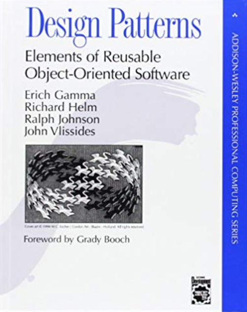

# 📦 Sistema de Integração de Estoque (WPF)


<p align="center">
  
  
  
  
</p>

Este projeto foi desenvolvido como requisito para a Situação de Aprendizagem (SA). O objetivo principal é demonstrar a aplicação prática de **Padrões de Projeto (GoF)**, princípios **SOLID** e boas práticas de arquitetura de software utilizando C# e Windows Presentation Foundation (WPF).

---

## 📖 A Origem do Padrão Adapter (Gang of Four)

O padrão **Adapter** não surgiu do nada. Ele faz parte de um catálogo lendário no mundo da engenharia de software criado por quatro autores: **Erich Gamma, Richard Helm, Ralph Johnson e John Vlissides**. 

Juntos, eles ficaram conhecidos como a **"Gang of Four" (Gangue dos Quatro, ou GoF)**. Em 1994, eles publicaram o livro *"Design Patterns: Elements of Reusable Object-Oriented Software"*. O objetivo deles não era inventar código novo, mas sim catalogar soluções brilhantes e repetíveis para problemas comuns que os programadores enfrentavam todos os dias na Orientação a Objetos.

Eles classificaram o **Adapter** como um **Padrão Estrutural**. Segundo o GoF, a intenção oficial do Adapter é *"converter a interface de uma classe em outra interface esperada pelos clientes, permitindo que classes trabalhem em conjunto, o que de outra forma seria impossível devido a interfaces incompatíveis"*. É exatamente esse conceito histórico que este projeto traz para a prática!



---

## 🔌 Padrão de Projeto Aplicado: Adapter (Estrutural)

O cenário do nosso sistema simula a necessidade de uma empresa importar dados de um sistema **ERP Legado**, cujas classes e propriedades são totalmente incompatíveis com o sistema de estoque moderno atual (ex: o sistema velho usa `string CodBarras` e `double PrecoFinal`, enquanto o novo exige `Guid IdProduto` e `decimal ValorUnitario`).

Para resolver essa incompatibilidade **sem modificar o código existente**, foi implementado o padrão Adapter.

![EXEMPLO DE IMAGEM: diagrama_uml_adapter.png]assets/estrutura do codigo.png)

* **Target (O Alvo):** `IFornecedor` e `ProdutoModerno` — Representa a interface e as classes que o sistema novo espera receber e entende perfeitamente.
* **Adaptee (O Incompatível):** `SistemaErpAntigo` e `ProdutoAntigo` — O sistema velho, com dados em formatos obsoletos e métodos defasados.
* **Adapter (O Tradutor):** `ErpAdapter` — A classe central desta SA. Ela implementa a interface do sistema novo, mas consome e converte os dados do sistema velho, fazendo a ponte entre os dois mundos.

### 🟢 Vantagens e Princípios SOLID alcançados:
* **Princípio de Responsabilidade Única (SRP):** Separamos a lógica complexa de conversão de dados da regra de negócio principal da tela.
* **Princípio Aberto/Fechado (OCP):** Podemos criar novos adaptadores no futuro (ex: `SistemaSAPAdapter`) sem precisar alterar o código central do estoque moderno.

---

## 🏗️ Arquitetura e Boas Práticas (MVVM)

Além do Padrão de Projeto exigido, o sistema foi desenhado utilizando a arquitetura **MVVM (Model-View-ViewModel)**, considerada o padrão ouro para aplicações WPF.


* **Model (Domínio):** Onde ficam nossas classes de negócio (`ProdutoModerno`, etc).
* **View (Interface UI):** O arquivo XAML (`MainWindow.xaml`). Ela não possui regras de negócio no *Code-Behind*, sendo responsável apenas pela renderização visual.
* **ViewModel (O Mediador):** Prepara os dados importados pelo Adapter e os expõe para a View. Utiliza a interface `INotifyPropertyChanged` para garantir que a tela seja atualizada automaticamente quando novos produtos chegarem.
* **Commands:** As ações de clique (como importar dados) não usam eventos engessados (`Click="Botao_Click"`), mas sim a interface `ICommand` através do `RelayCommand`, mantendo o isolamento do código.

---

## 📂 Estrutura de Diretórios

O projeto foi organizado de forma escalável, separando claramente as responsabilidades:

```text
📁 SistemaEstoqueWPF
 ┣ 📁 Adapters           # Contém a classe ErpAdapter (Padrão GoF)
 ┣ 📁 Models             # Classes de domínio e interfaces (Target e Adaptee)
 ┣ 📁 ViewModels         # Lógica de apresentação, Commands e Notificações
 ┣ 📁 Views              # Telas da aplicação em XAML
 ┣ 📁 Services           # Simulação do banco de dados do sistema legado
 ┗ 📜 App.xaml           # Ponto de entrada do WPF
